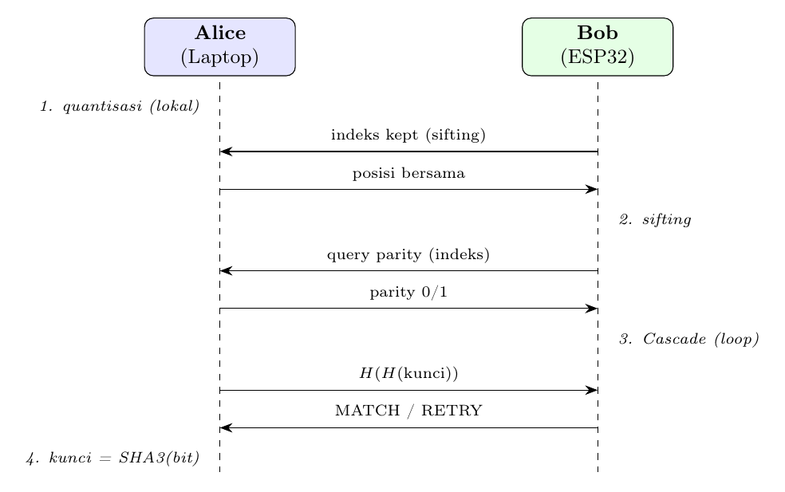

# Praktikum SKG — Secret-Key-Generation Sederhana (Alice ↔ Bob)


Dua perangkat mengukur sinyal WiFi (RSSI) kanal yang sama, lalu **menghasilkan kunci rahasia
yang identik tanpa pernah mengirim kunci itu**. Eve (penyadap) tidak bisa menurunkan kunci
karena yang lewat kanal publik hanya posisi indeks + parity, bukan nilai RSSI.



- **Alice** = laptop (Python)
- **Bob** = ESP32 (Arduino C++)

> Status: **teruji jalan**. Alice (Python) dan Bob (ESP32) menghasilkan kunci sama, `STATUS: MATCH`.

---

## 1. Konsep (4 langkah)

| Langkah | Apa yang terjadi |
|---|---|
| 1. **Quantisasi guard-band** | RSSI → bit (0/1). Sampel ambigu di tengah (mean ± α·std) dibuang. |
| 2. **Sifting** | Tukar **posisi** sampel yang dipakai; ambil irisan. (posisi = aman dibagi) |
| 3. **Rekonsiliasi (Cascade)** | Perbaiki bit yang beda pakai parity + binary search → bit jadi identik. |
| 4. **Privacy amplification** | Kunci = SHA3-256(bit). Menghapus info parity yang sempat bocor. |

Akhirnya kedua sisi tukar `H(H(kunci))` untuk verifikasi → **MATCH** atau **RETRY**.

---

## 2. Alat yang dibutuhkan

**Laptop (Alice)**
- Python 3.8+ (tanpa library tambahan — pakai pustaka standar saja)

**ESP32 (Bob)**
- **Arduino IDE** (atau `arduino-cli`)
- Board package **esp32** by Espressif
- Kabel USB data + driver USB-serial (CP210x / CH340)

**Jaringan**
- Satu WiFi/hotspot 2.4 GHz untuk laptop **dan** ESP32 (ESP32 klasik tidak support 5 GHz).
- Disarankan **hotspot HP**. Hindari WiFi kampus (sering ada *client isolation* / login enterprise).

---

## 3. Struktur repo

```
mahasiswa-skg/
├── alice/                  # dijalankan di LAPTOP
│   ├── alice.py            # program utama Alice
│   ├── skg_common.py       # 4 langkah SKG (quantisasi, sifting, cascade, kunci)
│   ├── sha3_256.py         # SHA3-256
│   ├── pcg32.py            # PRNG permutasi
│   ├── net.py              # koneksi TCP
│   └── synced_alice.csv    # dataset RSSI Alice
├── bob/                    # diunggah ke ESP32
│   ├── bob_esp32/
│   │   ├── bob_esp32.ino   # sketch Arduino
│   │   ├── skg.h           # 4 langkah SKG (C++)
│   │   └── synced_bob.h    # dataset RSSI Bob (embedded)
│   └── README.md
├── alice/README.md
└── docs/praktikum.tex      # panduan praktikum (LaTeX → PDF)
```

---

## 4. Langkah praktikum

### A. Siapkan jaringan
1. Nyalakan **hotspot HP** (2.4 GHz). Catat nama (SSID) + password.
2. Sambungkan **laptop** ke hotspot itu.

### B. Siapkan Bob (ESP32) — Arduino IDE
1. Install board esp32: Arduino IDE → *File → Preferences → Additional Boards Manager URLs*, isi:
   ```
   https://espressif.github.io/arduino-esp32/package_esp32_index.json
   ```
   Lalu *Tools → Board → Boards Manager*, cari **esp32**, install.
2. Buka `bob/bob_esp32/bob_esp32.ino`.
3. Isi WiFi di bagian atas sketch:
   ```cpp
   const char* WIFI_SSID = "NAMA_HOTSPOT";
   const char* WIFI_PASS = "PASSWORD_HOTSPOT";
   ```
4. *Tools → Board* = **ESP32 Dev Module**, *Port* = COM ESP32.
5. Klik **Upload**.
6. Buka **Serial Monitor** (115200 baud). Catat baris:
   ```
   WiFi OK, IP ESP32 = 192.168.x.y
   Bob menunggu Alice connect di port 6000...
   ```
   **IP itu dipakai Alice.**

> Alternatif `arduino-cli`:
> ```
> arduino-cli core install esp32:esp32
> arduino-cli compile --fqbn esp32:esp32:esp32 bob/bob_esp32
> arduino-cli upload  --fqbn esp32:esp32:esp32 -p COM_ESP32 bob/bob_esp32
> arduino-cli monitor -p COM_ESP32 -c baudrate=115200
> ```

### C. Siapkan Alice (laptop)
1. Buka `alice/alice.py`, isi IP ESP32 dari Serial Monitor:
   ```python
   BOB_IP = "192.168.x.y"   # IP ESP32
   ALPHA  = 1.0             # HARUS sama dgn bob_esp32.ino
   ```

### D. Jalankan
1. Pastikan ESP32 sudah menyala & "menunggu Alice" (langkah B6).
2. Di laptop:
   ```
   cd alice
   python alice.py
   ```

### E. Hasil yang benar
Laptop:
```
Sifting: posisi bersama = 123
Kunci Alice : 4c032a3015f75237...067ed8
Status      : MATCH
```
Serial Monitor ESP32:
```
Rekonsiliasi selesai, query parity = 88
STATUS: MATCH
Kunci Bob: 4c032a3015f75237...067ed8
```
**Kunci Alice == Kunci Bob → berhasil.**

---

## 5. Troubleshooting

| Gejala | Penyebab | Solusi |
|---|---|---|
| ESP32 cetak titik terus, tak dapat IP | WiFi salah / 5 GHz | Cek SSID/pass, pakai hotspot 2.4 GHz |
| Alice: `Gagal connect` | IP ESP32 salah / beda WiFi | Samakan WiFi, perbarui `BOB_IP` |
| Alice diam lama lalu gagal | *client isolation* di WiFi | Pakai hotspot HP |
| `STATUS: RETRY` | kanal terlalu bising (BER tinggi) | Naikkan `ALPHA` (mis. 1.2) di kedua sisi |
| Port COM tak kebuka saat upload | Serial Monitor masih terbuka | Tutup Serial Monitor dulu |

---

## 6. Catatan ilmiah (untuk laporan)

- **Keamanan**: kunci berasal dari RSSI resiprokal. Yang dikirim publik hanya posisi indeks +
  parity; nilai RSSI tak pernah dikirim, dan SHA3 (privacy amplification) menghapus parity bocor.
- **Entropi**: pada dataset Aulia synced + α=1.0 didapat 123 bit bersama, ~35 bit entropi bersih
  (parity bocor ~88). 256-bit hex itu *format*, bukan entropi. Untuk kunci lebih kuat: gabung
  beberapa skenario, atau naikkan α, atau pakai data korelasi lebih tinggi.
- **`ALPHA`**: naik → BER turun & rekonsiliasi murah, tapi jumlah bit turun. Default 1.0 teruji.
- **Determinisme**: dataset di-embed → kunci sama tiap run (cocok untuk demo & penilaian).
```
